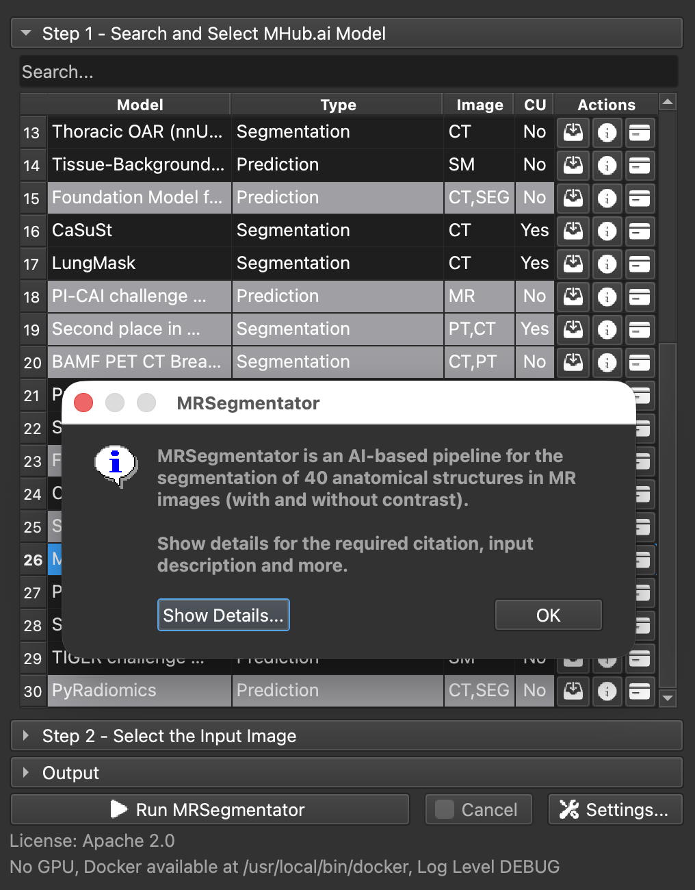

  

  
  
  
  

MHubRunner integrates containerized medical-imaging models from [MHub.ai](https://mhub.ai) into [3D Slicer](https://www.slicer.org/). It handles model discovery, Docker execution, run history, and loading supported results into the Slicer scene.

## MHub.ai

[MHub.ai](https://mhub.ai) makes medical-imaging models more accessible by packaging complete inference pipelines in containers and standardizing their inputs and outputs. Model descriptions, citations, licenses, and intended inputs are available from the MHub model catalog and the [MHubAI GitHub organization](https://github.com/MHubAI).

## Requirements

- 3D Slicer 5.12.x
- [Docker](https://docs.docker.com/get-docker/)
- A supported GPU and container runtime configuration for models that require GPU execution

The QuantitativeReporting extension is installed as an MHubRunner dependency.

## Usage

Load a volume into Slicer, then open **MHubRunner** from the module selector.

  

### Step 1 – Search and select a model

Use the search field to filter the available MHub.ai models. The table summarizes each model's type, accepted image modalities, and commercial-use status.

The action buttons let you:

- download or update the model's Docker image;
- inspect its description, expected inputs, license, and citation;
- open the complete model card on MHub.ai.

### Step 2 – Select the input image

Select the scalar volume that should be processed. MHubRunner can reuse DICOM data already indexed in Slicer's DICOM database or export a selected non-DICOM volume for model execution.

### Run the model

The main action button displays the selected model and starts its containerized workflow. GPU selection, Docker configuration, output behavior, and logging options are available under **Settings**.

### Load results

Each run is stored with a manifest containing its model, input identity, image digest, status, and declared outputs. The **Output** section can reopen past runs and load supported results, including:

- DICOM segmentation objects;
- generic JSON and CSV tables;
- model-specific tables and image annotations where a model handler is available.

Results loaded into the scene are grouped by run. Model-specific handlers may also link table rows with their corresponding image landmarks.

## Development status

This repository, MHubRunner, and the MHub model collection are under active development. Review each model's documentation and outputs carefully, retain the original data, and validate results independently before using them in research or clinical workflows.
